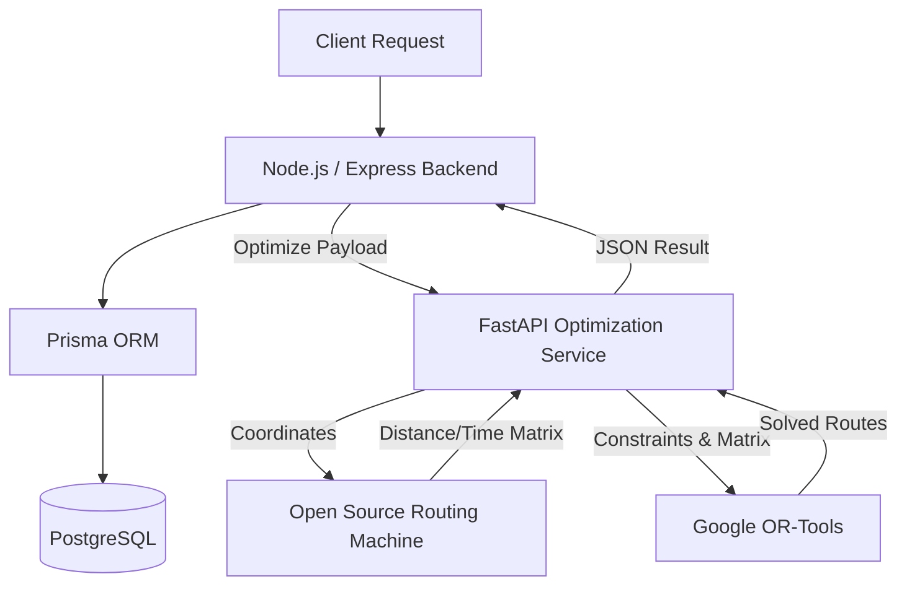

# Route Optimizer API

A powerful, microservices-based API for calculating optimal delivery routes. The platform leverages OpenStreetMap for geocoding, OSRM (Open Source Routing Machine) for generating real-world distance and time matrices, and Google OR-Tools for solving complex Vehicle Routing Problems (VRP) with capacities and time windows.

## 🌟 Project Overview

When dealing with delivery fleets, calculating the most efficient path between multiple stops is famously known as the Traveling Salesperson Problem (TSP) or Vehicle Routing Problem (VRP).

This project splits the architecture into two dedicated services:
1.  **Node.js / Express Backend**: Handles User Authentication (JWT), Database Persistence (PostgreSQL + Prisma), input validation, API routing, and geocoding via Nominatim.
2.  **Python / FastAPI Service**: A high-performance mathematical engine that fetches road network matrices from OSRM and crunches the routing optimization using Google's Operations Research tools (OR-Tools).

## 🏗️ Architecture



## 🛠️ Tech Stack

*   **Backend framework**: Node.js, Express.js
*   **Optimization Engine**: Python, FastAPI, Google OR-Tools
*   **Database**: PostgreSQL
*   **ORM**: Prisma
*   **Routing Data**: OSRM (Open Source Routing Machine)
*   **Geocoding**: OpenStreetMap (Nominatim API)
*   **Documentation**: Swagger UI / OpenAPI

## 📂 Folder Structure

```text
route-optimiser/
├── backend/                  # Node.js API Service
│   ├── prisma/               # Database schemas and migrations
│   ├── src/                  
│   │   ├── auth/             # JWT Authentication logic
│   │   ├── config/           # Environment and DB config
│   │   ├── location/         # Geocoding and coordinate validation
│   │   ├── optimization/     # Route optimization jobs and persistence
│   │   └── app.js            # Express application entry
│   └── swagger.yaml          # OpenAPI documentation spec
└── optimization-service/     # Python FastAPI Optimization Engine
    ├── models/               # Pydantic validation models
    ├── optimizer/            # Google OR-Tools solver logic
    ├── osrm/                 # OSRM API integration
    ├── validators/           # Request validation logic
    └── app.py                # FastAPI application entry
```

## 🗄️ Database Schema

The PostgreSQL database is managed via Prisma and contains the following core models:

*   **User**: Stores authenticated users.
*   **OptimizationJob**: The parent container for a routing task (e.g., "Morning Delivery Run"), tracking vehicle count and status (`DRAFT`, `PROCESSING`, `COMPLETED`).
*   **Location**: Represents a physical address attached to a Job. Contains geocoded latitudes and longitudes, and prevents physical coordinate duplication.
*   **Route**: Represents a single vehicle's optimized journey, storing total distance (km) and duration (minutes).
*   **RouteStop**: Represents a specific stop on a route, explicitly linking a `Route` to a `Location` with a designated sequence number.

## 🚀 API Endpoints

Interactive documentation is available via Swagger UI.

1. Start the Node.js backend.
2. Navigate to: `http://localhost:3000/api-docs`

### Core Routes Overview:
*   `POST /auth/register` - Create an account
*   `POST /auth/login` - Authenticate and get JWT
*   `POST /optimization` - Create a new routing job
*   `POST /optimization/:id/locations` - Geocode and add addresses to the job
*   `PATCH /optimization/:id` - Configure the start and end locations
*   `POST /optimization/:id/optimize` - Trigger the OR-Tools optimization engine
*   `GET /optimization/:id/result` - Fetch the beautifully formatted final route results

## ⚙️ Installation & Run Instructions

You will need to run both the Node.js backend and the Python optimization service concurrently.

### 1. Start the Node.js Backend

```bash
cd backend
npm install
# Ensure PostgreSQL is running and DATABASE_URL is set in .env
npx prisma db push
npm start
```
*Server will run on `http://localhost:3000`*

### 2. Start the Python Optimization Engine

```bash
cd optimization-service
# (Optional) Create and activate a virtual environment
pip install -r requirements.txt
uvicorn app:app --reload --port 8000
```
*Server will run on `http://localhost:8000`*

## 🔮 Future Improvements
- **Interactive Map UI**: A React/Next.js frontend using Leaflet or Mapbox to visually display the optimized routes and pins.
- **Dynamic Time Windows**: Allow users to specify exactly when a specific delivery must be completed.
- **Real-Time Traffic**: Integrate a paid routing matrix provider (like Google Maps Distance Matrix API) instead of OSRM for live traffic delay handling.
